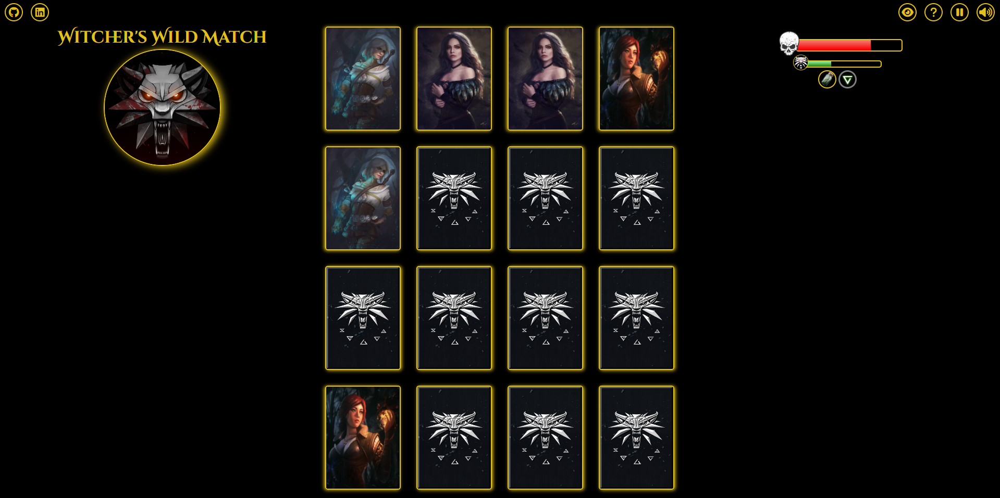
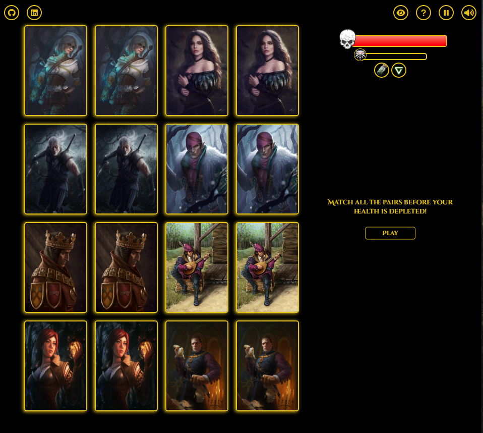
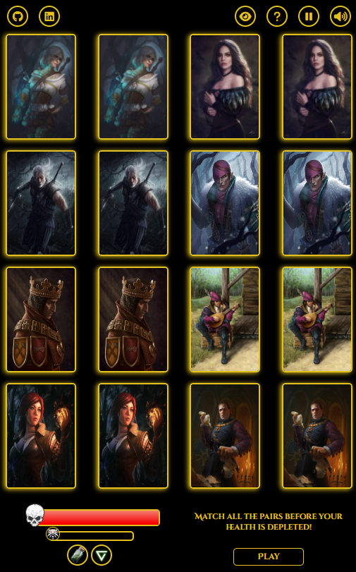

<h1>Witcher's Wild Match</h1>

<h5>Inspired by The Witcher video game series, this matching game app challenges players to strategically match eight unique cards within a limited number of chances. Players must recall the location of the cards with each flip, aiming to match all pairs before their health bar depletes. Drawing from the game series, the app features special powers like the Cat potion, which briefly reveals all hidden cards, and the Axii sign, which automatically matches a pair. These abilities offer a fun and unique way to engage with the world of The Witcher while playing the game.</h5>

<h4>Instructions</h4>

<h5>The objective of the game is clear: match all eight pairs of cards before your health bar runs out, and fill up your progression bar in the process. As you match pairs, your progression bar fills up, bringing you closer to victory. But be careful not to run out of health before you finish - strategic thinking is key to succeeding in this exciting matching game.</h5>

<h4>Live Game</h4>

https://witcherswildmatch.netlify.app/

<h4>Technologies Used</h4>

<ul>
<li>HTML</li>
<li>CSS</li>
<li>JavaScript</li>
</ul>

<h4>Screenshots</h4>

